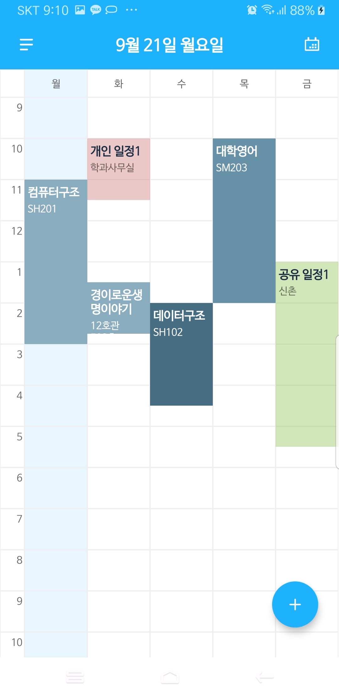
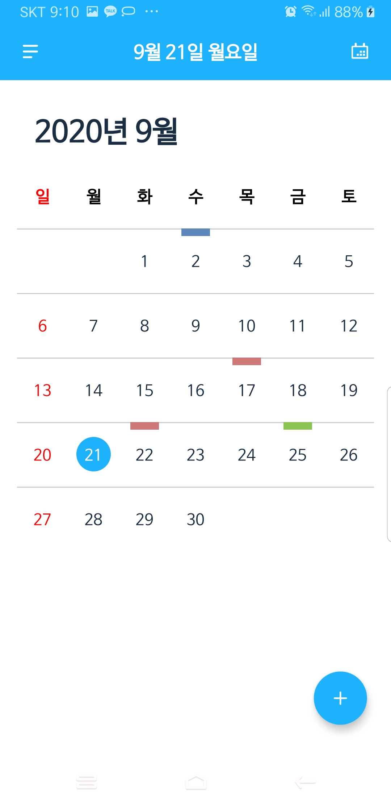
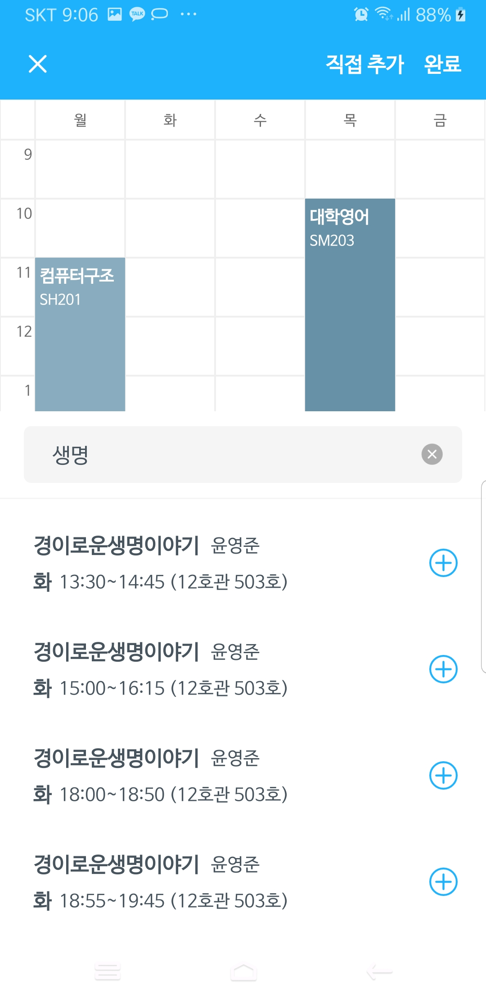
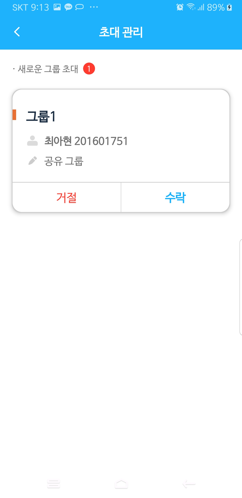
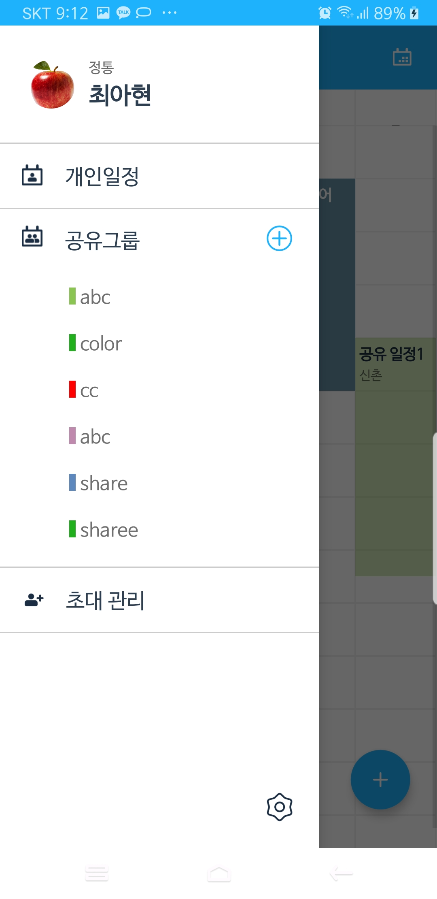

# INU 아마따 🗓 for Android
개인 일정과 참여하는 그룹의 멤버들이 공유하는 일정을 학교 시간표와 함께 나타내는 시간표 & 캘린더 어플리케이션

## Description
- 이번 주 일정을 시간표와 함께 나타내는 시간표 화면
- 인천대학교 시간표 정보와 연동되는 시간표 검색
- 초대받은 공유 그룹 수락 혹은 거절
- 개인 일정과 참여하는 공유 그룹별 일정 관리
- 시간표 화면과 캘린더 화면으로 일정 확인

## Screenshots

## Tech / Framework
* Android
* Java
* Retrofit2
* Glide
* Room

## Library
* [TimetableView](https://github.com/tlaabs/TimetableView) - Customize
* [CalendarView](https://github.com/kizitonwose/CalendarView)
* [ExpandableLayout](https://github.com/cachapa/ExpandableLayout)
* [Android-PickerView](https://github.com/Bigkoo/Android-PickerView)
* [CircleImageView](https://github.com/hdodenhof/CircleImageView)
* [colorpicker](https://github.com/kristiyanP/colorpicker)
* [Album](https://github.com/yanzhenjie/Album)

## Developer / Designer
- Android
  - 최아현
  - 이강민
- Server
  - 임태호
- Design
  - 정서연
  - 이예린
  - 이수정